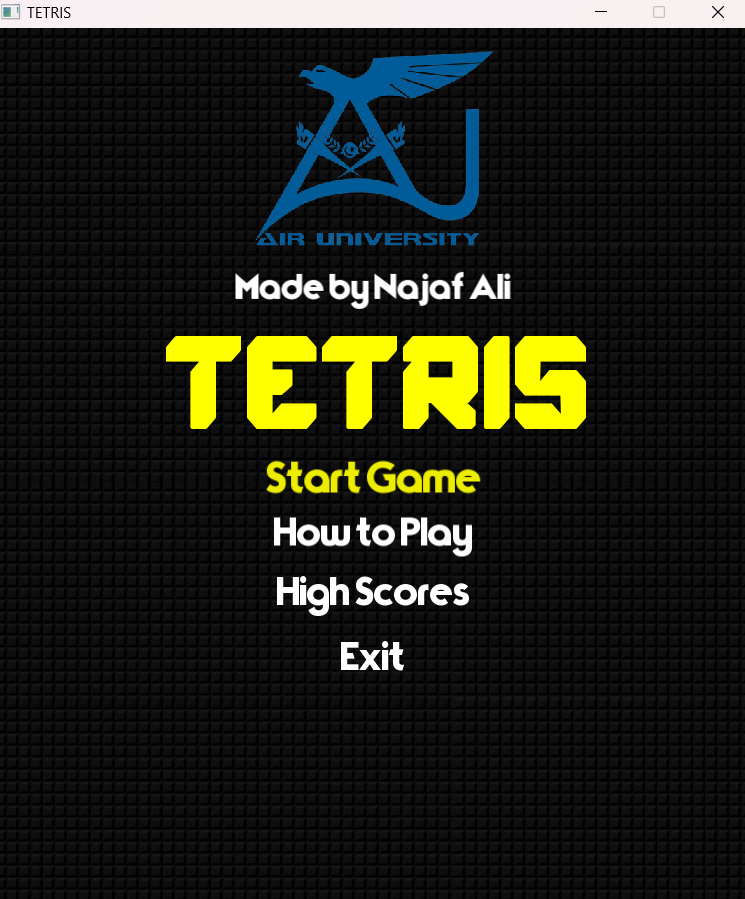
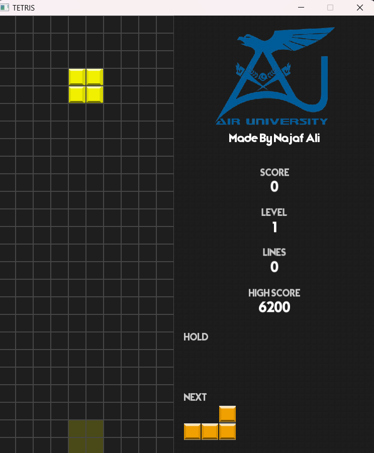

# SFML Tetris Clone (NDBA51)

A classic Tetris game implemented in C++ using the SFML (Simple and Fast Multimedia Library). This project includes core Tetris mechanics along with features like piece holding, next piece preview, ghost piece, scoring, levels, high score tracking, and visual/audio effects.





## Features

*   Classic Tetris gameplay: Move, rotate, soft drop, and hard drop pieces.
*   Multiple game states: Main Menu, Playing, Paused, Game Over.
*   Next Piece Preview: See the upcoming piece.
*   Hold Piece: Store a piece for later use (once per piece lock).
*   Ghost Piece: Shows where the current piece will land after a hard drop.
*   Scoring System: Score points based on cleared lines and current level.
*   Levels & Difficulty: Game speed increases as you clear more lines.
*   Persistent High Score: Saves the overall highest score and a Top 5 list to files (`highscore.txt` and `highscores.txt`).
*   Informational Screens: Includes "How to Play" and "High Scores" views accessible from the menu.
*   Visual Effects: Particle system animates line clears.
*   Audio: Background music and sound effects for rotation, dropping, and line clearing.
*   Customizable Assets: Uses external files for fonts, textures, and sounds located in the `resources` folder.
*   Sidebar UI: Displays score, level, lines cleared, high score, hold piece, and next piece.

## How to Play

*   **Left/Right Arrow Keys:** Move the current piece left or right.
*   **Up Arrow Key:** Rotate the current piece clockwise.
*   **Down Arrow Key:** Soft drop the piece (move down faster).
*   **Spacebar:** Hard drop the piece instantly to the bottom.
*   **C Key:** Hold the current piece (can be swapped later). You can only hold once per piece that appears until it locks.
*   **ESC Key:** Pause the game while playing, or return to the main menu from the "How to Play" / "High Scores" screens.
*   **Enter Key:** Select an option in the main menu.

## Dependencies

1.  **C++ Compiler:** A modern C++ compiler that supports C++11 or later (e.g., g++, Clang, MSVC).
2.  **SFML Library:** Version 2.5.1 or newer. You need the following modules:
    *   Graphics
    *   Window
    *   Audio
    *   System

## Installation & Setup

1.  **Install a C++ Compiler:** If you don't have one, install g++ (Linux/macOS/MinGW on Windows), Clang, or Visual Studio (Windows).
2.  **Install SFML:**
    *   **Linux (apt - Debian/Ubuntu):**
        ```bash
        sudo apt-get update
        sudo apt-get install libsfml-dev
        ```
    *   **Linux (pacman - Arch):**
        ```bash
        sudo pacman -S sfml
        ```
    *   **macOS (Homebrew):**
        ```bash
        brew install sfml
        ```
    *   **Windows:** Download the appropriate pre-compiled libraries (matching your compiler, architecture, and build type) from the [official SFML website](https://www.sfml-dev.org/download.php). You'll need to configure your compiler/IDE to find the SFML headers and link against the library files. Using a package manager like vcpkg can simplify this.
    *   **From Source:** You can also build SFML from source using CMake. Follow the instructions on the SFML website.

## How to Compile and Run

1.  **Clone the Repository:**
    ```bash
    git clone <your-repository-url>
    cd <repository-folder-name>
    ```
    *(Replace `<your-repository-url>` and `<repository-folder-name>`)*

2.  **Ensure Resources:** Make sure the `resources` folder containing all the necessary `.png`, `.ttf`, `.wav`, and `.ogg` files is in the same directory as the `main.cpp` file (or where you build the executable).

3.  **Compile:** Open a terminal or command prompt in the project directory. The exact command depends on your compiler and how SFML is installed. Here's a common example using g++:

    ```bash
    g++ main.cpp -o tetris -lsfml-graphics -lsfml-window -lsfml-system -lsfml-audio
    ```

    *   `g++`: Your C++ compiler.
    *   `main.cpp`: The source code file.
    *   `-o tetris`: Specifies the output executable name (`tetris`).
    *   `-lsfml-graphics`, `-lsfml-window`, etc.: Links the required SFML libraries.

    **Important Notes:**
    *   If the compiler cannot find SFML headers (`#include <SFML/...>`), you may need to specify the include path using `-I/path/to/sfml/include`.
    *   If the linker cannot find the SFML library files, you may need to specify the library path using `-L/path/to/sfml/lib`.
    *   **Windows:** You might need to copy the SFML DLL files (e.g., `sfml-graphics-2.dll`, `sfml-window-2.dll`, etc.) into the same directory as your compiled `tetris.exe` file, or ensure they are in your system's PATH.

4.  **Run:** Execute the compiled program from the directory containing the executable and the `resources` folder:

    *   **Linux / macOS:**
        ```bash
        ./tetris
        ```
    *   **Windows:**
        ```bash
        .\tetris.exe
        ```
        or simply:
        ```bash
        tetris
        ```

    The game window should appear. The game will create `highscore.txt` and `highscores.txt` in the same directory when you finish a game if they don't exist.

## File Structure
/your-project-folder
|-- .gitignore          
|-- main.cpp            # Source code
|-- Project10.sln       # Visual Studio Solution file
|-- Project10.vcxproj   # Visual Studio Project file
|-- Project10.vcxproj.filters # Visual Studio filters file (optional but common)
|-- CppProperties.json  # VS Code/Intellisense configuration (optional but common)
|-- /resources          # Folder containing game assets
|   |-- background.png
|   |-- block0.png      # Cyan I
|   |-- block1.png      # Blue J
|   |-- block2.png      # Orange L
|   |-- block3.png      # Yellow O
|   |-- block4.png      # Green S
|   |-- block5.png      # Magenta T
|   |-- block6.png      # Red Z
|   |-- university_logo.png # Your logo texture
|   |-- main_font.ttf
|   |-- title_font.ttf
|   |-- background_music.ogg
|   |-- clear.wav
|   |-- drop.wav
|   |-- rotate.wav
|-- README.md   

## Author

*   Najaf Ali
